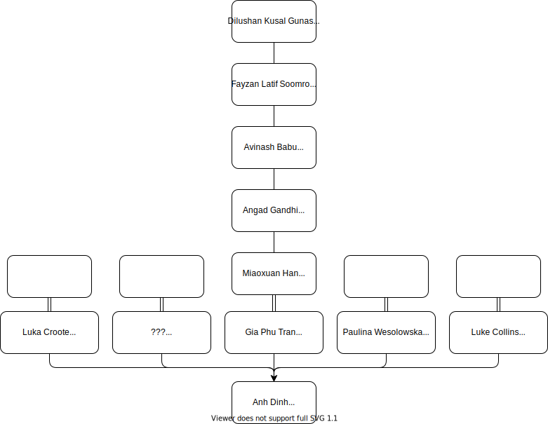
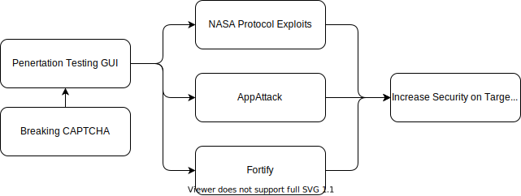

# Hardhat Enterprises

## Table of Contents
- [Hardhat Enterprises](#hardhat-enterprises)
  - [Table of Contents](#table-of-contents)
- [Company Structure and Objectives for 2022 T3](#company-structure-and-objectives-for-2022-t3)
  - [Executive Summary](#executive-summary)
    - [For our Stakeholders](#for-our-stakeholders)
    - [For our Employees](#for-our-employees)
    - [Leadership Team](#leadership-team)
  - [Trimester Goals and Objectives](#trimester-goals-and-objectives)
  - [Company Structure and Projects Overview](#company-structure-and-projects-overview)
    - [General Overview](#general-overview)
    - [Project Relationships](#project-relationships)
    - [Breaking CAPTCHA](#breaking-captcha)
      - [Overview, Goals, and Objectives](#overview-goals-and-objectives)
      - [Aims for Trimester](#aims-for-trimester)
      - [Deliverables](#deliverables)
      - [Project Members](#project-members)
    - [Penetration Testing GUI](#penetration-testing-gui)
      - [Overview, Goals, and Objectives](#overview-goals-and-objectives-1)
      - [Aims for Trimester](#aims-for-trimester-1)
      - [Deliverables](#deliverables-1)
      - [Project Members](#project-members-1)
    - [App Attack](#app-attack)
      - [Overview, Goals, and Objectives](#overview-goals-and-objectives-2)
      - [Aims for Trimester](#aims-for-trimester-2)
      - [Deliverables](#deliverables-2)
      - [Project Members](#project-members-2)
    - [Fortify](#fortify)
      - [Overview, Goals, and Objectives](#overview-goals-and-objectives-3)
      - [Aims for Trimester](#aims-for-trimester-3)
      - [Deliverables](#deliverables-3)
      - [Project Members](#project-members-3)
    - [NASA Exploits Project](#nasa-exploits-project)
      - [Overview, Goals, and Objectives](#overview-goals-and-objectives-4)
      - [Aims for Trimester](#aims-for-trimester-4)
      - [Deliverables](#deliverables-4)
      - [Project Members](#project-members-4)
    - [Appendix A](#appendix-a)
      - [Breaking Captcha Team Members](#breaking-captcha-team-members)
    - [Appendix Penetration Testing GUI Team Members](#appendix-penetration-testing-gui-team-members)
    - [Appendix C](#appendix-c)
      - [App Attack](#app-attack-1)
    - [Appendix D](#appendix-d)
      - [Fortify Team Members](#fortify-team-members)
    - [Appendix E](#appendix-e)
      - [NASA Exploits Project Team Members](#nasa-exploits-project-team-members)

# Company Structure and Objectives for 2022 T3
## Executive Summary
### For our Stakeholders
Hardhat Enterprises is an organization that aims to create cyber weapons and tools that can be used to empower white-hat operations. All deliverables produced by the company will be open source so that anyone may use and benefit from them. These deliverables should either improve on existing tools or fill a market need that is not yet met.

### For our Employees
Hardhat Enterprises will aim to provide its employees with opportunities to:
- Build up their skills and knowledge.
- Create meaningful connections.
- Produce meaningful deliverables that will showcase their abilities.

### Leadership Team
The below outlines the membership of the leadership team for this trimester:

## Trimester Goals and Objectives
This trimester Hardhat Enterprises aims to:  
- Achieve an engaging learning experience for students within the company.
- Achieve an opportunity for students to gain cross-department/project experience and the chance to share their expertise outside of their project team.
- Continue maturing the five projects; AppAttack; Breaking CAPTCHA; Fortify; and NASA Protocol Exploits. These projects will continue into future trimesters and allow students to showcase their skills. All projects will be open source for students to show to prospective employers. 

## Company Structure and Projects Overview
### General Overview
This trimester (T3/2022), the company is working on four different projects, each supporting the company's goals in another way. Unfortunately, given the limited number of members this trimester, our fifth project, the Penetration testing GUI has been suspended until further notice.  

### Project Relationships
NASA Protocol Exploits, App Attack, and Fortify all directly contribute to the goals of the company.
Apart from the contribution to the goals of the company: 
- Penetration Testing GUI will also act as a tool that can potentially support the goals and objecting of the NASA protocol exploits project, AppAttack, and Fortify Projects. 
-	Breaking CAPTCHA could also provide an attack method that would be integrated into the PT GUI software as an additional capability. 

### Breaking CAPTCHA
#### Overview, Goals, and Objectives

The goal of the Breaking CAPTCHA project is to develop machine learning, AI, and computer vision models to autonomously solve CAPTCHA problems. The final product of the project will be to provide end users with an interface to solve these CAPTCHA problems. This user interface will be the focus of future iterations. The Hardhat Director wants a product that improves upon current open-source solutions for this problem. As a result, the models to be produced will need to be either more accurate, reliable, or solve a novel issue facing current CAPTCHA solving models. This will be done through several steps, including research and development, creating of models, and deployment of models, as well as engineering of deployment and model pipelines. This will be supported by cloud infrastructure developed to solve storage, processing, DevOps, and handover issues allowing for the production of ‘infrastructure as code’ artifacts.  

#### Aims for Trimester

The project aims for this trimester are to leverage the learnings of previous work as well as the current capability of the team. Our trimester deliverables will be: •

- Infrastructure as code product to enable efficient handover of cloud infrastructure. 
- Improving the performance of the Machine learning model that breaks Audio CAPTCHAs.
- Developing novel methods for solving Audio CAPTCHAS
- Progressing the development of a non-segmentation model that will break text CAPTCHAs.
- An Improved pipeline that connects R&D and UI deliverables through Machine Learning pipelines, CI/CD pipelines, and improved infrastructure.
- Improving the showcase website in both usability and runtime.

#### Deliverables

Trimester Deliverables

- Text and Audio CAPTCHA breaking black box models, which are versioned and operationalized
- Improved performance of CAPTCHA breaking models
- Improved runtime of Cloud-based solutions
- Connectivity between R&D and Products using Cloud resources as well as CI/CD and ML pipelines
- Improved Documentation of progress to date
- Improved analysis of the state of art of the Breaking CAPTCHA
- Possibly research and proof of concept solutions for cognitive reasoning-based CAPTCHAS

Long-Term Deliverables
  - An end-user product that will allow a user to solve CAPTCHA in real-time with minimal human input 
  - App or website
  - Chrome Extension

#### Project Members
[Please see Appendix A - Breaking CAPTCHA](#appendix-a)

### Penetration Testing GUI
#### Overview, Goals, and Objectives
Deakin Detonator Toolkit (DDT) is a toolkit that aims to simplify the penetration testing experience and workflow. The toolkit was initially started as a Command Line Interface (CLI) toolkit with a few minor tools.

#### Aims for Trimester
The Penetration Testing GUI will not be continuing this trimester.

#### Deliverables
Long-Term Deliverables for the project: 
1. Improve user interface/user experience.
2. Achieve 80% test coverage for the project, minimizing the risk of regression across the development lifecycle.
3. Implement more attack vectors to the toolkit.•Create more walkthroughs and educational guides on best leveraging the toolkit to perform a penetration test.

#### Project Members
[Please see appendix B - Penetration Testing GUI](#appendix-b)

### App Attack
#### Overview, Goals, and Objectives

Deakin's OnTrack online application will undergo secure code review and web application penetration testing from AppAttack. The objective is to deliver a comprehensive security report to Deakin that includes the identification of vulnerabilities and recommendations for application and code hardening.

The AppAttack project for this trimester will begin from scratch. Except for retesting prior findings, earlier iterations and deliverables won't be carried over into this trimester.

Additionally, the goal of AppAttack is to provide internal deliverables to support subsequent rounds of AppAttack and deliverables of value to our customer Deakin. Internal deliverables aim to develop a methodology, frameworks, report templates, a centralized knowledge base, and exploitation tools to speed up client deliverables and increase the range of services and products offered by AppAttack.

#### Aims for Trimester

- Build a testing environment 
- Improving our testing environments
  - Each subteam will dive deep into one particular part of OnTrack (like authentication, APIs) 
  - Provides instructions on replicating the updated environment.
  - Allow the next trimester can do the work continuously and not restart.
- Perform penetration testing on OnTracks in an attempt to find working exploits for the vulnerability
  - Both successful and unsuccessful exploits should be recorded and discussed, including the
process of trial and error that was used to reach a working exploit
- Provide analysis for OnTrack codebase's security provider recommendations for both vulnerable and potentially dangerous
- Develop procedures, templates, and techniques.
- Create an experience that is comparable to the industry for students to emphasize resumes when applying for high-caliber professions.
- Add value for stakeholders, clients, and students.
- Offer Deakin University deliverables that are worthwhile.

#### Deliverables

- Deliver a Web Application Penetration Testing Report and Secure Code Review to Deakin University to meet the industry standard.
- Cover all parts of OnTrack's codebase 

#### Project Members
[Please see appendix C - App Attack](#appendix-c)

### Fortify
#### Overview, Goals, and Objectives

Fortify is a platform that connects volunteer cyber security professionals with organizations that need assistance building their system security. Fortify attempts to address security flaws and problems that typically affect small enterprises and non-profit organizations that lack the resources to hire a skilled cybersecurity team. The goal of Fortify is to connect these companies with qualified volunteers who can help raise awareness of cyber security practices, give them a chance to evaluate their present security posture and strengthen their security capabilities, and give the volunteers the opportunity to showcase their cyber expertise and broaden their network. It's also vital to note that Fortify’s long-term goal is to become a non-profit organization that promotes its services all throughout Australia, improving overall security and defending against cyber-attacks. The Fortify project for this trimester builds on existing work finalized in previous trimesters and aims to summarise it, fill the gaps and create a comprehensive report that describes all business operations from start to finish.

#### Aims for Trimester

-	Update the existing website designs and mock-ups
-	Create a comprehensive plan on how to build a website and a database in a secure manner. 
-	Start the work on developing the website 
-	Build a questionnaire for clients  based on Essential 8
-	Create a report showcasing all business procedures with use cases 
-	Create selection criteria for becoming a volunteer

#### Deliverables

•	Improved design of the website 
•	Research and proof of concept solutions for Fortify website and database
•	The landing page and environments for the website
•	Developed and refined cyber security assessment questionnaire and scoring matrix
•	A clear and comprehensive report with the plan and explanation of all business operations 

#### Project Members
[Please see appendix D - Fortify](#appendix-d)

### NASA Exploits Project
#### Overview, Goals, and Objectives

The NASA Protocol Exploits project consists of a team of students that aim to evaluate and investigate the current implementation of the ION. Our overall goal is to analyze the source code and environment to identify various vulnerabilities in the protocols and systems used for space communications and to ultimately document successful exploitations, the methodologies behind them, and potential remedies.

#### Aims for Trimester
The NASA Protocol Exploits team aims to advance the project in three different areas over T3 of 2022. The three areas the project seeks to improve are as follows; **Static Code Analysis** - Given the nature of work, the static analysis team carried out in previous trimesters and the list of vulnerabilities generated via automated vulnerability/defect services such as Coverity. The group aims to work through the highest-priority vulnerabilities and document their findings alongside reviewing several aspects of the environment's source code. Some tasks include but are not limited to:
  * Reporting on the validity of previously detected vulnerabilities.
  * Reporting the potential impact of such vulnerabilities.
  * Providing potential remedies and/or code fixes.
  * Developing and deploying exploits from said vulnerabilities.  
  
**Dynamic Code Analysis** - The dynamic analysis team aims to continue developing and deploying various fuzzing tools/techniques from the last trimester. The goal is to attack the testing environment to see multiple protocols within the DTN stack react and report on the findings. Some tasks include but are not limited to:
  * Developing various fuzzing tools using python libraries.
  * Developing various attack scenarios.
  * Reporting on the techniques used and experiment findings.

**Improve Company Documentation / Environment** - All project members aim to improve the overall quality of training materials, and the current way documentation is kept with the end goal of migrating resources to GitHub. Some tasks include but are not limited to: 
 * Contributing to the NASA Exploits Project GitHub.
 * Converting older resources in SharePoint to markdown for better source control.
 * Improving the current state of training material / junior onboarding process. 
 * Improving the current state of the testing environment.

#### Deliverables
Trimester deliverables for the following teams:  
  1. Static Analysis Team: 
     - Vulnerability Reports and Findings
     - Exploits?!
  2. Dynamic Analysis Team:
     - Fuzzing Scripts for the following protocols; CFDP, AOS, BP, and LTP.
     - Vulnerability Reports.
     - Experiment Finding Reports.
     - Attack Scenarios.
  3. Project Leadership / Contributing Members:
     - Company Handbook on GitHub.
     - Updated Training Resources.
     - Various Frameworks for vulnerability identification and Reporting
   
Long-Term Deliverables for the project: 
  1. Successful exploitation of the protocol, potential real-world satellite interception.
  2. Write/Submit a script to automatically exploit the protocol or intercept satellite communications.
  3. Create a resource pool for the future extensibility of the project.
  4. Present research findings and remediation recommendations to NASA.
  5. Attain access to the full version of ION.

#### Project Members
[Please see appendix D - NASA Exploits Project](#appendix-e)

### Appendix A
#### Breaking Captcha Team Members
| Name                  | Role                  |
| -----------           | -----------           |
| Luka Croote           | Project Lead          |
| NGUYEN NGOC BACH LUU  | Text CAPTCHA R&D           |
| Jamil Rizkallah       | Audio CAPTCHA R&D           |
| Inder Singh           | Audio CAPTCHA R&D           |
| Fenglu Cai            | Audio CAPTCHA R&D           |
| Tanya Gural           | Cloud/DevOps Engineer, Scrum master           |
| Ridwan Ganiyu         | Audio CAPTCHA R&D           |
| Koshila Dodantenna    | Cloud Engineer           |

### Appendix Penetration Testing GUI Team Members
| Name                  | Role                  |
| -----------           | -----------           |
| -                   | Project Lead          |

### Appendix C
#### App Attack
| Name                          | Role                  |
| -----------                   | -----------           |
| Gia Phu Tran                  | Project Lead          |
| Miaoxuan Han                  | Vice Project Lead     |
|Angad Gandhi                   | Team Lead, Technical Lead |
|Avinash Babu                   | Team Lead | 
|Fayzan Latif Soomro            | Team Lead |  
|Dilushan Kusal Gunasekara      |Penetration Tester, Reporting Lead| 
|Dilshan Wickramasinghe         | Penetration Tester|
|Suntosh Mudaliar               | Penetration Tester|
|John Patrick Thomas            | Penetration Tester|
|Shavon Martin                  | Penetration Tester|
|Kevin Nguyen                   | Penetration Tester|
|Rusith Siriwardena             | Penetration Tester|
|Matthew Shiroodi               | Penetration Tester|
|Gleb Spektor                   | Penetration Tester|
|Jack Sievers                   | Penetration Tester|
|Beau Williams                  | Penetration Tester|
|Pamudu Wickrama                | Penetration Tester|
|Oliver Power                   | Penetration Tester|
|Olivia Vosdoganis              | Penetration Tester|
|Ashen Udara Madurawala         | Penetration Tester|
|Mitchell Burcheri| Penetration Tester |
|Muhammad Saim Khan| Penetration Tester |
|Diomedes Dio Kyrou| Penetration Tester |
|Vick Kumar| Penetration Tester |

### Appendix D
#### Fortify Team Members
| Name                               | Role                  |
| -----------                        | -----------           |
| Paulina Wesolowska                 | Project Lead          |
| Shravan Paladugu                   | Team Lead             |
| Abigail Chong                      | Development Team      |
| Ali Adil Abdulrazzaq Al-Kinan      | Development Team      |
| David Wang                         | Development Team      |
| Harry Singh                        | Development Team      |
| Nadia Maharani Azhari              | Development Team      |
| Tom Edmondson                      | Development Team      |
| Beatrice Jeruto Rerimoi            | Development Team      |
| Bill Petridis                      | Team Lead             |
| Aayush Talwar                      | Research Team         |
| Kevin Kidd                         | Research Team         |
| Luke Newton                        | Research Team         |
| Manav Lath                         | Research Team         |
| Muhammed Khudruj                   | Research Team         |
| Ranjan Weerasinghe                 | Research Team         |

### Appendix E
#### NASA Exploits Project Team Members
| Name                  | Role                  |
| -----------           | -----------           |
| Luke Collins          | Project Lead          |
| Zara Rose Scherger    | Junior Project Lead   |
| Yongxiang Huang       | Researcher            |
| Connie Cox            | Researcher            |
| Jesse Ludeman         | Researcher            |
| Izaz ishaque          | Researcher            |
| Tristen Clifton       | Researcher            |
| Andrew Eymard         | Researcher            |
| Yizhou Feng           | Researcher            |
| Sadeepa Kaushal Meegahawathhage | Researcher  |
| Vihan Malalaweera Arachchige    | Researcher  |
